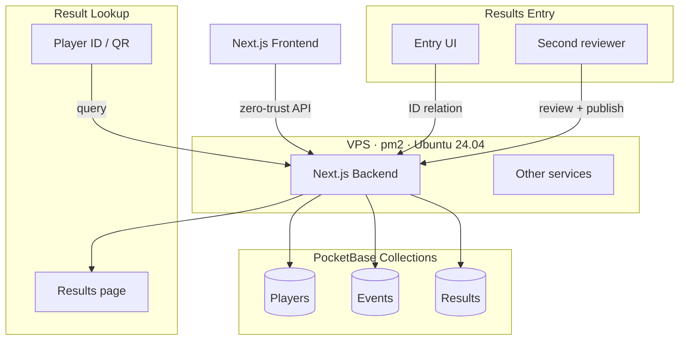

<ProjectStatus status="archived" updated="2025-11-17" />

In November 2025, the 28th All India Forest Sports Meet brought **3,390 athletes** to Dehradun — forest department staff and officers from 30 states, 6 Union Territories, and 6 central institutions, competing across 24 sports and 270-plus individual events over five days. It's the kind of event where the results website is basically a piece of public infrastructure for the duration of the meet: athletes' families checking results, officials coordinating schedules, administrators pulling reports.

I built that website. Six weeks, solo, first year of college.

This is the debrief.


## How this landed on me

The project existed in some form for months before I touched it. Organizers had approached faculty at UPES well in advance, and a small design team — two or three people, including Amritanshu Rawat, who'd later collaborate with me on the finished product — had been working in Figma since early on.

The problem: **the officials thought the Figma work was the website.** Not a Figma prototype they'd hand off to developers — the actual deliverable. Design and development meant the same thing to them. This is a common enough confusion, but it hit particularly hard here because registration needed to open soon, and at the point where someone looked hard at the situation, there was only a design file and no working code.

My professor called me.

I don't want to be coy about what "called me in" meant — there was no formal contract, no onboarding process, no signed agreement of any kind. Word of mouth through faculty, which is how a lot of this kind of thing moves. I'd later end up working directly with the senior officials running the event for most of the day-to-day decisions. The scope of actual responsibility (sole technical ownership of a live government system, direct line to the event committee) was a bit out of proportion with the informal way I got there, but that's how it went.

My first commit was September 27.

## The brief

Before I wrote any code, I was briefed twice. Once informally, by Amritanshu — a proper planning conversation, what officials wanted, how they envisioned registration working, what the event actually was. Then formally, by an official from the Uttarakhand Forest Department, who laid out the scope as they'd planned it.

The Figma I received as "finalized" was, in practice, the top-level pages: homepage, about, contact. Everything else — registration flow, results system, data architecture, admin tooling — I'd be designing and building from scratch.

One thing worth saying plainly: **scope didn't creep on this project**, at least not in the usual sense. What was discussed in that first meeting was what got built, with one deliberate addition I'll get to. That almost never happens, and I'm not sure how much of it was the client being unusually clear versus me being aggressive about defining what was and wasn't in scope from day one.

## Figma to code

The first three or four days were straightforward conversion work: take the Figma top-level pages and turn them into working Next.js components. No effective export tooling helped here — it had to be done by hand.

I made a deliberate call to hand-write roughly **80% of the UI code** rather than lean on AI generation. The reasoning is simple: I was going to be the only person maintaining this codebase, under real-world time pressure, during a live national event. I couldn't afford to be debugging code I didn't actually understand. I used AI assistance for base layout scaffolding — the boilerplate I'd burn time on but learn nothing from — and did the positioning, responsiveness, and fine-detail work myself.

That choice added time upfront. It was the right call.

{/* IMAGES — site screenshots go well here, showing the finished UI.
    Suggested 2-up ImageGallery: homepage + results/medal tally page.
    Take these as browser screenshots and host under /brain/pictures/projects/aifsm2025/:
      - /brain/pictures/projects/aifsm2025/site-home.png
      - /brain/pictures/projects/aifsm2025/site-results.png */}

<ImageGallery
  images={[
    { src: "/brain/pictures/projects/aifsm2025/site-home.png", alt: "AIFSM 2025 homepage" },
    { src: "/brain/pictures/projects/aifsm2025/site-results.png", alt: "Live results and medal tally page" },
  ]}
/>

## Architecture, and why

The stack is **Next.js** on the frontend, **PocketBase** on the backend, running on a VPS I controlled entirely — Ubuntu 24.04, sized generously enough that it could host other projects too, paid for through the project budget. Services ran under `pm2`, executed by a low-privilege user account created specifically for this, with inter-service communication over closed pipes rather than open network ports.

I chose Next.js and PocketBase because I already knew them. That's the honest reason. I wasn't optimizing for architectural elegance; I was trying to make something work fast. PocketBase in particular is convenient for this kind of build — it gives you a real database, file storage, auth, and an admin UI without a lot of overhead.

The VPS setup was my first time hosting anything at this scale. I wasn't cavalier about security — I manually pen-tested each feature as I built it, checking for auth bypass, unauthorized database access, XSS vectors, privilege escalation, exposed secrets on the client side, and injection vulnerabilities. It wasn't a formal audit, but it was deliberate and systematic, feature by feature.

### The results data model

The results entry system is relational rather than form-based. Instead of a text field that submits raw result data, the entry UI uses autocomplete to create relationships between existing database records — a player record, an event record, and a result record — keyed off IDs throughout. Every result is traceable back to a specific player ID, which is the same ID the credential system uses. It also means there's no obvious route for submitting an arbitrary string as a result; the entry flow only knows how to link things that already exist in the database.

Not a particularly exotic design, but it was the right call for this use case.



## The first deadline, and building yourself out of the loop

Officials originally wanted the backend and registration live by October 5. I was ready to hit that. The deadline then shifted to October 10 — not because I asked, and not because I was behind. I used the extra five days for polish and bug fixes rather than scrambling to catch up.

The one place where scope genuinely expanded: the **admin dashboard**. This wasn't in the original brief. I added it because without it, I'd be a permanent operational bottleneck — every registration action, every data update, every announcement would require me to touch the database directly. That's not a tenable position when officials need to manage a national sporting event.

So I built a management system: a proper admin UI that let officials handle day-to-day operations themselves. Gallery/CMS management, results entry, announcements. The goal was to make myself unnecessary for anything that wasn't a real technical problem. It worked.

## Going live, and the Haryana problem

Registration opened and things moved quickly. Multiple states and Union Territories began submitting without issues, and watching real registrations come in from across the country was genuinely exciting in a way that's hard to articulate if you haven't been in that position before.

Then Haryana had login issues.

Haryana was the first state to use multiple staff representatives to handle registration (rather than a single point of contact), and some of their staff logins weren't working. No other state reported anything similar. I couldn't access their machines directly, couldn't be on-site, couldn't reproduce it — troubleshooting happened through a relay: I'd suggest something, tell the official I was in contact with, that official would relay it to the Haryana-side contact, and the response would work its way back through the same chain.

Eventually something cleared it. The best guess is caching — some combination of old hardware and unusual browser caching behavior. Nothing on my end broke and no code changes were made to fix it. I don't know the exact root cause. Cache-clearing on their side seems to have been the resolution, but I'm not confident in that as a full explanation.

<NoteBox title="On diagnosing remote issues">
This is one of the frustrating properties of debugging infrastructure you don't control: sometimes "it works now" is the only data point you get. In this case I'm reasonably sure the issue was client-side, but the relay-based troubleshooting process means I'm working with secondhand signal throughout. I'd rather say that plainly than reconstruct a confident diagnosis I didn't actually have.
</NoteBox>

## Building the rest of the plane while it's flying

With registration live and national in scope, taking the site offline wasn't an option. I needed to roll out the remaining pages — gallery, news, committee, contact, about, results — incrementally, against a live audience, without killing what was already working.

This went fine. Almost entirely fine.

There was one incident. I was doing a fast dev-to-prod sync — moving a large batch of changes over quickly, partly out of curiosity about how fast I could do it — and forgot to update the orchestration file that tells `pm2` how to find and run the results-page service. The results page started returning 500s. The rest of the site kept working normally.

One-line fix once I identified it. Total blast radius: one page, one service, a short window. Not a crisis. I mention it because a debrief that omits the mistakes isn't a debrief.

## The credential system

Between the registration cutoff and the event start (roughly October 28 through November 4, per git), I built a credential generation system: player ID cards, physically printed with lanyards, distributed at the event.

Each card carries a QR code that ties back to the same relational results model described above. Scanning a card opens a page showing that player's recorded results — so the credential doubles as a kind of results verification artifact. The connection between registration data, physical credential, and live results was one clean loop.

The rest of the pipeline I'll leave here. The concept is what's worth noting.

{/* IMAGES — if you have a photo of a printed ID card (without personally identifying info
    visible, or a test/sample card), this is a good place for it. Totally optional — the
    section works fine without one. Host at /brain/pictures/projects/aifsm2025/id-card-sample.jpg if you
    want to include it. */}

## How results actually went live

I wasn't on-site during the competition days (November 12–16). I was there beforehand for setup and training, and at the closing ceremony, but not during the actual events. My visibility into exactly how the control room operated is secondhand.

What I walked officials through in training: the gallery CMS page and the results entry interface. They picked it up essentially immediately — understood it "even before I explained it" is how I'd put it — which saved me from having to redesign anything on the spot.

The results workflow, as I understand it: when an event finished, the result got relayed to the control room, one person entered it into the system, a second person double-checked it against the actual recorded outcome, and then it was published. The results appeared on the public site and on a TV display in the control room simultaneously. Latency from an event finishing to appearing live was a few minutes. There was no hard SLA on that.

One thing I want to be clear about: **the live medal tally is not a backend engineering feat.** The tally is computed client-side, off a points formula I worked out by hand. Individual event results are worth 5/3/2/1 points for gold through fourth; team events are 10/6/4/2. The "live" part is just that the data behind it updates as results are published. The points math is straightforward and runs in the browser. I'm mentioning this because the feature looks more sophisticated than it is, and I'd rather represent it accurately.

<Math latex="\\text{Total Points} = \\sum_{\\text{individual}} \\begin{cases} 5 & \\text{gold} \\\\ 3 & \\text{silver} \\\\ 2 & \\text{bronze} \\\\ 1 & \\text{4th} \\end{cases} + \\sum_{\\text{team}} \\begin{cases} 10 & \\text{gold} \\\\ 6 & \\text{silver} \\\\ 4 & \\text{bronze} \\\\ 2 & \\text{4th} \\end{cases}" />

{/* IMAGES — found both of these in the photo set, and they're a near-literal match
    for this section: one shows the actual "Control Room" signage, the other the
    Result/Prize/Medal/Souvenir committee desk handling the workflow described above. */}

<ImageGallery
  images={[
    { src: "/brain/pictures/projects/aifsm2025/control-room.jpg", alt: "IT & Publicity control room, AIFSM 2025" },
    { src: "/brain/pictures/projects/aifsm2025/results-committee.jpg", alt: "Result, Prize, Medal & Souvenir committee at work" },
  ]}
/>

## Five quiet days

The event ran November 12–16. I was not pulled in for anything.

No incidents. No remote firefighting. I went on with my day while 3,390 athletes competed, officials entered results, and the site ran without me. This is what the admin dashboard and the pre-event architecture work were for. I didn't build a self-serve system because it was technically interesting — I built it because I didn't want to be woken up at 2am during the javelin finals.

It worked.

## The numbers

<Timeline
  items={[
    { title: "First commit", date: "2025-09-27", description: "September 27 — project begins" },
    { title: "Backend & registration live", date: "2025-10-10", description: "Original target was Oct 5; deadline shifted without request. Used the extra time for polish." },
    { title: "Gallery and results services operational", date: "2025-10-12", description: "Incremental rollout continues against live national registration" },
    { title: "Credential / ID card system", date: "2025-10-28", description: "Oct 28 – Nov 4: card generation with QR codes, professionally printed with lanyards" },
    { title: "Event: AIFSM 2025", date: "2025-11-12", description: "Nov 12–16, Dehradun. Five quiet days." },
    { title: "Closing ceremony", date: "2025-11-17", description: "Highest-ever recorded participation. Site handed off to static state." },
  ]}
/>

| Metric | Value |
| --- | --- |
| First commit | September 27, 2025 |
| Backend / registration live | October 10, 2025 |
| Event dates | November 12–16, 2025 |
| Total commits | ~60 |
| Total lines of code | 28,758 (excl. `node_modules`, `.next`, `dist`, build artifacts) |
| Primary language | TypeScript — 15,390 lines across 86 files |
| Athletes who competed | 3,390 |
| Teams | 42 (30 states, 6 UTs, 6 central teams) |
| Sports / events | 24 sports / 270+ individual events |
| Post-event visitor count | ~15,000 |
| Developer (code / infra) | 1 |
| Design-phase contributors | ~2–3 (incl. Amritanshu Rawat) |
| Stack | Next.js + PocketBase |
| Hosting | Self-owned VPS, Ubuntu 24.04, `pm2`, low-privilege service account |
| Formal contract | None |

<ExpandableSection title="Raw cloc output">

```text
172 text files.
155 unique files.
58 files ignored.

github.com/AlDanial/cloc v 1.98  T=0.26 s (604.9 files/s, 129459.1 lines/s)
-------------------------------------------------------------------------------
Language                     files          blank        comment           code
-------------------------------------------------------------------------------
TypeScript                      86           1452            741          15390
YAML                             7           1899              0           6842
SVG                             15              0              0           4486
JavaScript                      31            189             86            972
INI                              1              6              0            420
JSON                             8              0              0            363
CSS                              1             10              1            109
XML                              2              0              0             66
Markdown                         2             25              0             58
CSV                              1              0              0             43
Text                             1              3              0              9
-------------------------------------------------------------------------------
SUM:                           155           3584            828          28758
-------------------------------------------------------------------------------
```

</ExpandableSection>

## Closing ceremony

At the closing ceremony, officials stated this was the highest recorded participant turnout in the event's history, with every state and Union Territory represented.

The external numbers hold that up directionally: the 2024 edition in Raipur had 2,916 athletes from 29 states, 8 UTs, and 6 forest institutions. This year's 3,390 from 30 states, 6 UTs, and 6 central teams is a genuine increase — roughly 16% more athletes, total coverage across all participating entities. I can't locate a transcript of the exact closing remarks, but the numbers themselves are consistent with the claim.

An official thanked "me and my team for making this event possible." The team in that context was everyone from UPES involved across the project's life — the professor, the design-phase contributors, Amritanshu. The code and infrastructure were mine alone. But being thanked directly at a national government event closing ceremony, when you're a first-year CS student who wasn't sure six weeks ago whether you'd pull this off — that one landed.

{/* IMAGES — picked the three strongest from the set: a high-jump action shot for
    sport variety, a podium/medal moment, and a full team lineup for the contingent feel. */}

<PhotoGrid
  images={[
    { src: "/brain/pictures/projects/aifsm2025/event-athletics-highjump.jpg", alt: "High jump event, AIFSM 2025" },
    { src: "/brain/pictures/projects/aifsm2025/event-medal-ceremony.jpg", alt: "Medal ceremony, AIFSM 2025" },
    { src: "/brain/pictures/projects/aifsm2025/event-contingent-hockey.jpg", alt: "Hockey team lineup, AIFSM 2025" },
  ]}
/>

## Retrospective

When I think back on this project, what strikes me is that it never really felt like a "first-year project." It felt like any other build I'd done — same problems, same debugging loops, same satisfaction when something worked the way it should. The only thing that was genuinely new was the scale of the audience on the other end of the code. Not the seniority of who I was working with, not the responsibility of maintaining live government infrastructure. Just: there were thousands of people out there whose experience of this event ran through something I'd written.

That's a different feeling. Hard to describe exactly, but real.

What I'm most satisfied with is the admin system — not as a technical achievement, but as a design decision. Building a self-serve management interface meant that I wasn't operationally necessary during the event itself. The thing ran without me. That's the point.

The site is now reset to a mostly static state — registration stripped out, event concluded. The visitor counter peaked at around 15,000 during and shortly after the event; it's lower now since the site is essentially an archive at this point. I have no visibility into whether any of this codebase gets reused for next year's host state. Project's done, as far as I can tell.

If I did this again I'd go in with a more comprehensive CI/CD pipeline from day one. This was my first project at a scale where things actually mattered — where a careless deploy could affect a live national audience — and I was building the tooling as I went rather than starting with it. The orchestration-file incident was a symptom of that. I have those tools now. Future projects will start with them already in place.

<LinkCard href="https://aifsm2025.in" title="AIFSM 2025" description="Live site — currently reset to static archive state." />
