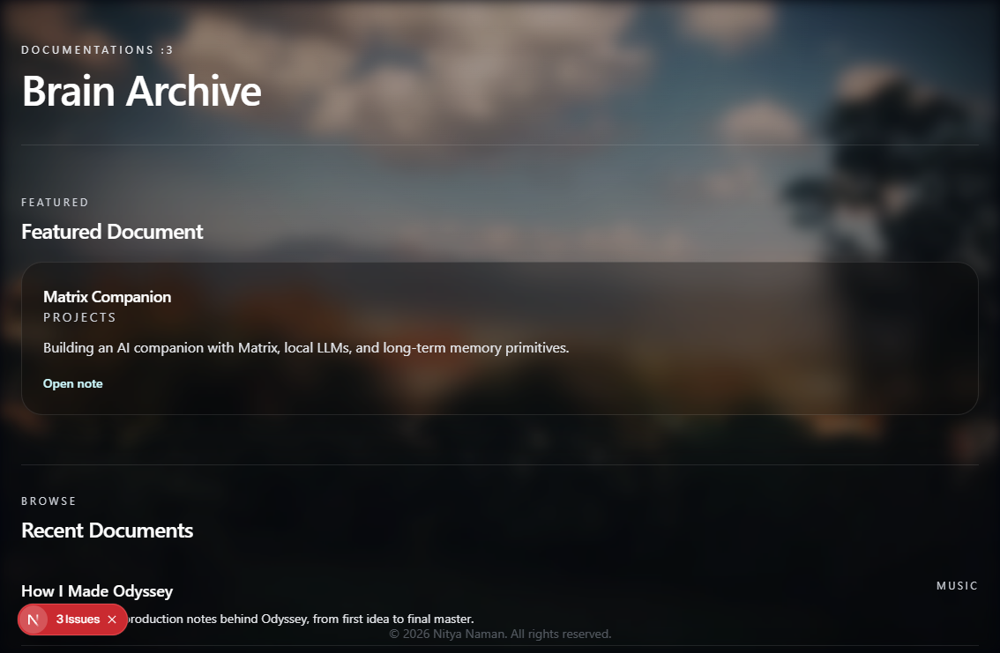

# Brain MDX Typography Guide

This document explains how MDX content in Brain is written, how it renders on the website, and what each common element looks like in the current glassmorphic theme.

Rendered example:



Scope:

- Brain documents rendered through the MDX pipeline
- Typography and spacing from `app/globals.css`
- MDX custom components from `components/mdx/index.tsx`
- The visual language used inside article bodies, callouts, code blocks, embeds, and interactive content

## 1. What This System Is

Brain uses MDX so each document can mix normal markdown with React components.

That means a page is usually:

- metadata in frontmatter
- a normal markdown article
- optional custom components for special content

The document should read like a note or article first. Components are there to support the writing, not replace it.

## 2. Content Model

Brain pages are written as MDX documents with frontmatter at the top and content underneath.

The important frontmatter fields are:

- `id`: stable identifier
- `title`: the visible page title
- `description`: short summary used in cards, metadata, and previews
- `category`: primary content group such as `projects`, `research`, `music`, or `setups`
- `created`: publish or creation date
- `updated`: optional update date
- `status`: optional status label such as `active`
- `visibility`: usually `public`
- `index`: whether the page should be indexed and included in Brain listings
- `featured`: whether the page should be promoted in the Brain home page
- `tags`: array of tags
- `related`: array of linked document ids
- `seoTitle`, `seoDescription`, `seoKeywords`: optional metadata overrides
- `featuredImage`: optional social/OG image

Example:

```mdx
---
id: signal-notes
title: Signal Notes
description: Architecture notes for a reactive signal processing system.
category: research
created: 2026-06-15
updated: 2026-06-15
status: active
visibility: public
index: true
featured: true
tags:
  - signal
  - audio
  - workflow
related:
  - signal-processing-primer
  - envelope-mapping
---
```

Important distinction:

- `category` and `tags` are data fields
- they are not typography settings
- they should stay clean and semantic

## 3. Overall Reading Style

Inside the article body, Brain prose is intentionally calm and dense, not oversized or presentation-heavy.

The base prose rules are:

- body text is a light gray, not pure white
- line height is generous for long-form reading
- headings are bold and tight
- article spacing is controlled with predictable vertical rhythm
- links are underlined with a soft white decoration instead of a colored link style

On smaller screens, the type scale tightens slightly so long articles stay readable without feeling overly large.

## 4. Headings

Headings are the main structural signal in Brain.

### `# H1`

Use this once per document for the page title inside the article body.

Example:

```mdx
# Signal Notes
```

Appearance:

- very large
- bold
- tight letter spacing
- sits at the top of the article body
- visually matches the page title but remains part of the content flow

### `## H2`

Use this for major sections.

Example:

```mdx
## Overview
```

Appearance:

- large section heading
- a horizontal divider line appears above it
- more spacing above than below
- anchors are generated automatically for deep linking

### `### H3`

Use this for subsection blocks inside a larger section.

Example:

```mdx
### Signal Chain
```

Appearance:

- smaller than H2, still prominent
- bold
- tighter spacing than H2
- useful for nested structure inside a long note

### `#### H4`

Use this for minor labels or sub-subsections.

Example:

```mdx
#### Notes
```

Appearance:

- small, uppercase-feeling label
- muted gray
- spaced more like a section label than a headline

### Heading Anchors

Every H2-H4 gets an anchor icon appended by the renderer.

Appearance:

- the anchor is faint by default
- it becomes brighter on hover
- it is meant for copying deep links, not as decoration

## 5. Paragraphs and Body Text

Normal paragraphs are the default writing mode.

Example:

```mdx
Signal Notes explains how envelopes, smoothing, and mapping curves are combined into a stable reactive pipeline.
```

Appearance:

- light gray text
- comfortable line height
- slightly larger than default site text
- designed for long reading sessions

Use plain paragraphs when the content is explanatory, narrative, or technical.

## 6. Strong and Emphasis

### Strong text

Example:

```mdx
This is **important**.
```

Appearance:

- bright white
- slightly heavier weight
- stands out without becoming a color accent

### Emphasis

Example:

```mdx
This is _subtle_.
```

Appearance:

- italic emphasis, inherited from browser defaults
- stays within the same neutral palette

## 7. Links

Brain links are intentionally understated.

### Internal links

Example:

```mdx
See [Projects](/brain/projects) for implementation work or [Research](/brain/research) for deeper notes.
```

Appearance:

- white text at reduced emphasis
- underlined with a soft white decoration
- hover state brightens the text and underline

### External links

Example:

```mdx
Read the docs at [Matrix](https://matrix.org).
```

Appearance:

- same typography treatment as internal links
- open in a new tab by default through the MDX link component
- still feels part of the article instead of a separate UI pattern

## 8. Lists

### Unordered lists

Example:

```mdx
- Transport layer
- Inference layer
- Memory layer
```

Appearance:

- white/neutral bullets
- compact spacing between items
- used for short structured lists

### Ordered lists

Example:

```mdx
1. Collect context
2. Normalize inputs
3. Map the result
```

Appearance:

- standard numbered list styling
- same neutral text treatment as body copy
- useful for procedures and workflows

## 9. Blockquotes

Example:

```mdx
> Local-first is a constraint, not a slogan.
```

Appearance:

- frosted translucent panel
- left border in soft white
- slightly muted text
- reads like an inset note or quoted remark

Use blockquotes for:

- important definitions
- quoted statements
- callout-style emphasis without needing a custom component

## 10. Inline Code

Example:

```mdx
Use `category`, `tags`, and `slug` consistently.
```

Appearance:

- rounded mini pill
- translucent white background
- light border
- monospaced text
- slightly smaller than surrounding prose

Use inline code for:

- field names
- command names
- function names
- short literal values

## 11. Code Blocks

Code blocks are one of the most polished parts of the Brain renderer.

### Standard fenced code

Example:

````mdx
```ts
export function mapEnergy(v: number) {
  const clamped = Math.max(0, Math.min(1, v));
  return Math.pow(clamped, 1.6);
}
```
````

````

Appearance:
- glass card container
- translucent white background
- soft border
- rounded corners
- blurred backdrop
- title strip at the top when a filename is provided
- copy button in the top-right corner
- syntax highlighted through Shiki when highlighting succeeds

### With filename

Example:

```mdx
<CodeBlock language="ts" filename="mapping.ts">
  {`export function mapEnergy(v: number) {
  const clamped = Math.max(0, Math.min(1, v));
  return Math.pow(clamped, 1.6);
}`}
</CodeBlock>
````

Appearance:

- header row shows the filename on the left
- language label appears next to the filename
- copy button remains visible in the header
- code area stays wide and scrollable on overflow

### Highlighting behavior

Pretty-code line highlighting is supported.

Appearance details:

- highlighted lines receive a soft white background
- highlighted characters get a subtle glow-like block
- line numbers and code body remain readable against the glass panel

## 12. Callout Boxes and Notes

Brain includes custom boxes for semantic emphasis.

These components all share the same neutral glass language:

- translucent white background
- soft white border
- rounded corners
- blurred backdrop
- light text

### `Callout`

Example:

```mdx
<Callout>This is the place to explain what the note is doing and why it exists.</Callout>
```

Appearance:

- neutral boxed note
- strongest when used for key context or warnings about interpretation

### `InfoBox`

Example:

```mdx
<InfoBox title="Build Note">This note uses the local MDX renderer and neutral glass styling.</InfoBox>
```

Appearance:

- compact info panel
- title in small uppercase text
- body text underneath with enough spacing to breathe

### `WarningBox`

Example:

```mdx
<WarningBox title="Caution">This is experimental and may change.</WarningBox>
```

Appearance:

- same glass panel structure
- visually neutral in the current theme, not loud red/yellow
- the title carries the warning meaning more than the color does

### `SuccessBox`

Example:

```mdx
<SuccessBox title="Complete">The build passed and the route is stable.</SuccessBox>
```

Appearance:

- same neutral panel treatment
- good for positive status, completion notes, or confirmed behavior

### `NoteBox`

Example:

```mdx
<NoteBox title="Implementation Detail">The renderer should stay readable before it becomes decorative.</NoteBox>
```

Appearance:

- soft note block
- best for side observations and implementation reminders

## 13. Status Pills

Example:

```mdx
<ProjectStatus status="active" updated="2026-06-15" />
```

Appearance:

- inline pill-style badge
- rounded full border
- translucent glass fill
- small status dot at the left
- uppercase, compact, and easy to scan

Use this for:

- project lifecycle
- active/inactive states
- lightweight metadata inside a document

## 14. Timeline

Example:

```mdx
<Timeline
  items={[
    { title: "Transport Layer", description: "Matrix room + bridge strategy" },
    { title: "Inference Layer", description: "llama.cpp runtime with model fallback" },
    { title: "Memory Layer", description: "hybrid retrieval + compact long-term graph" },
  ]}
/>
```

Appearance:

- vertical timeline with a left border line
- dots for each item
- title is bold white text
- date is small uppercase muted text
- description is lighter gray and slightly smaller

Best use:

- architecture phases
- release history
- setup steps with progression

## 15. Expandable Sections

Example:

```mdx
<ExpandableSection title="Implementation Notes">
  More detail can live here without interrupting the main flow.
</ExpandableSection>
```

Appearance:

- collapsible glass panel
- border and blur match the rest of Brain
- summary text is bold
- content reveals underneath with breathing room

Use expandable sections for:

- deep implementation details
- secondary material
- anything the reader may want to skip initially

## 16. Media Embeds

### YouTube

Example:

```mdx
<YouTubeEmbed id="dQw4w9WgXcQ" title="Demo" />
```

Appearance:

- rounded embed frame
- translucent border
- blurred glass backdrop
- maintains video aspect ratio

### Spotify

Example:

```mdx
<SpotifyEmbed id="track/12345" />
```

Appearance:

- same glass frame language
- fixed-height embed area
- designed to blend into a long-form note rather than look like a foreign widget

### Generic video

Example:

```mdx
<VideoEmbed src="https://example.com/embed/video" title="Demo video" />
```

Appearance:

- glass container
- 16:9 responsive ratio
- suitable for demos and walkthroughs

## 17. Image Grids

### ImageGallery

Example:

```mdx
<ImageGallery
  images={[
    { src: "/pictures/embed/home.png", alt: "Home view" },
    { src: "/pictures/embed/detail.png", alt: "Detail view" },
  ]}
/>
```

Appearance:

- 2-column grid on larger screens
- soft rounded corners
- light border on each image
- spacing is modest so the gallery feels part of the article

### PhotoGrid

Example:

```mdx
<PhotoGrid
  images={[
    { src: "/pictures/embed/a.png", alt: "Shot A" },
    { src: "/pictures/embed/b.png", alt: "Shot B" },
    { src: "/pictures/embed/c.png", alt: "Shot C" },
  ]}
/>
```

Appearance:

- denser grid than `ImageGallery`
- square crops
- best for photographic contact sheets or compact visual references

## 18. Download and Link Cards

### FileDownload

Example:

```mdx
<FileDownload href="/files/mapping.pdf" label="Download mapping notes" />
```

Appearance:

- inline download button
- glass border and fill
- compact and obvious as a file action

### LinkCard

Example:

```mdx
<LinkCard href="https://matrix.org" title="Matrix" description="Protocol reference" />
```

Appearance:

- large linked card
- subtle hover state
- good for related resources and external references

## 19. Tables

Markdown tables render as framed panels with a subtle tinted background.

Example:

```mdx
| Layer     | Purpose         |
| --------- | --------------- |
| Transport | Message routing |
| Memory    | State retention |
```

Appearance:

- boxed table container
- soft translucent background
- padded cells
- muted header row
- readable, but not meant to dominate the page

## 20. Horizontal Rules

Example:

```mdx
---
```

Appearance:

- wide divider
- soft white line
- used to split long sections without introducing a new component

## 21. Typography Tone Rules

When writing Brain MDX, keep the tone of the page aligned with the visuals:

- direct, technical, and intentional
- not overly ornate
- not SEO-heavy inside the body
- not documentation-for-the-sake-of-documentation

The design language is neutral glass, so the writing should also be clean and structured.

Good writing patterns:

- clear section titles
- short introductory paragraphs
- mixed prose and component blocks
- linked references instead of repeated explanations

Avoid:

- giant walls of text without headings
- unnecessary emoji in the body
- decorative component overload
- color language that assumes the old blue/navy theme

## 22. URL and Data Rules

This repository keeps Brain URLs and data structures predictable.

Use:

- `category` for the document's grouping field
- `tags` for cross-cutting labels
- clean route names for categories
- explicit tag paths when linking tags

Do not encode personality into URL paths or schema names.
Personality belongs in copy, titles, and the writing itself.

## 23. Practical Authoring Checklist

Before publishing a Brain document:

- confirm the frontmatter is complete
- choose one clear H1
- break content with H2s and H3s
- use code blocks only for actual code or structured output
- use callouts for important notes, not every note
- link related Brain pages instead of repeating them
- preview the page on mobile and desktop

## 24. Visual Summary

A finished Brain MDX page should look like this:

- a strong title and concise description at the top
- soft neutral glass panels for notes and code
- readable prose with comfortable spacing
- muted anchors and inline links
- enough hierarchy to scan quickly, but not so much contrast that it feels like a separate product

If the page feels more like a glossy docs site than a page inside ciderboi.xyz, it is probably too cold or too blue.
